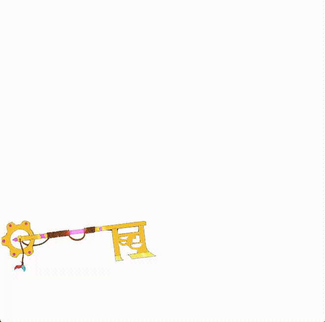

# gdx-TinyVG

A libgdx parser and renderer for TinyVG https://www.tinyvg.tech/

[](https://github.com/lyze237/gdx-TinyVG/actions?query=workflow%3A%22Test%22)
[](https://github.com/lyze237/gdx-TinyVG/blob/main/LICENSE)
[](https://jitpack.io/#lyze237/gdx-TinyVG)
[](https://coffee.lyze.dev)

# What is TinyVG?

SVG is a horribly complex format and an overkill for most projects. The specification includes way too many edge cases so implementing a new SVG renderer will always have drawbacks or missing pieces.

TinyVG tries to be simpler. Fewer features, but powerful enough to cover 90% of use cases. ~ https://tinyvg.tech



# Convert SVG into TVG

Make sure to set the following export settings:
* "inline style" (and not for example "internal css")
* Convert text to path

Then simply convert your SVG into a TVG here: https://svg-to-tvg-server.fly.dev/

Only linear and radial gradients with two points are supported. Everything else should convert decently enough.

# Video

Here's a youtube video showcasing the library:

[](http://www.youtube.com/watch?v=9bDaH6SaUwg)

# Example

```java
public class Lwjgl3Launcher {
  public static void main(String[] args) {
    createApplication();
  }

  private static Lwjgl3Application createApplication() {
    return new Lwjgl3Application(new Main(), getDefaultConfiguration());
  }

  private static Lwjgl3ApplicationConfiguration getDefaultConfiguration() {
    Lwjgl3ApplicationConfiguration configuration = new Lwjgl3ApplicationConfiguration();
    // By default, stencils are disabled, we need those though. So let's enable them here (It's the 6th value. Change that to >= 2).
    configuration.setBackBufferConfig(8, 8, 8, 8, 16, 2, 0);
    // ...

    // In a legacy desktop project it's:
    config.stencils = 2; // >= 2
    return configuration;
  }
}

public class Example extends ApplicationAdapter {
  private TinyVG tvg;
  private TinyVGShapeDrawer drawer;
  private Viewport viewport = new XXXViewport(xxx, xxx);

  public void create() {
    var assetLoader = new TinyVGAssetLoader();
    tvg = assetLoader.load("file.tvg"); // only works with the binary file format

    // TinyVGShapeDrawer requires a 1x1 white pixel file,
    // so either create one in your favourite art program or
    // use the other constructor which creates one for you.
    // https://github.com/lyze237/gdx-TinyVG/blob/main/src/test/resources/pixel.png
    drawer = new TinyVGShapeDrawer(new SpriteBatch(), new TextureRegion(new Texture("pixel.png")));
    drawer = new TinyVGShapeDrawer(new SpriteBatch());

    // You're also able to create a texture region directly out of a tvg file:
    var tvgRegion = TinyVGIO.toTextureRegion(tvg, drawer);
  }

  public void render() {
    Gdx.gl.glClearColor(0.25f, 0.25f, 0.25f, 1);
    Gdx.gl.glClear(GL20.GL_COLOR_BUFFER_BIT);

    viewport.apply();

    drawer.getBatch().setProjectionMatrix(viewport.getCamera().combined);

    // Centers origin and rotates it.
    tvg.centerOrigin();
    tvg.setRotation(tvg.getRotation() + 10 * Gdx.graphics.getDeltaTime());

    drawer.getBatch().begin();
    tvg.draw(drawer);
    drawer.getBatch().end();
  }

  @Override
  public void resize(int width, int height) {
    viewport.update(width, height, true);
  }
}
```

Alternatively you can load it via an AssetManager
```java
public class Example extends ApplicationAdapter {
  private TinyVG tvg;
  private TinyVGShapeDrawer drawer;
  private Viewport viewport = new XXXViewport(xxx, xxx);

  public void create() {
    var assetManager = new AssetManager();
    assetManager.setLoader(TinyVG.class, new TinyVGAssetLoader());

    assetManager.load("square.tvg", TinyVG.class);

    assetManager.finishLoading();

    var tvg = assetManager.get("square.tvg", TinyVG.class);
  }
}
```
Or directly create a texture region out of it:
```java
public class Example extends ApplicationAdapter {
  public void create() {
    var drawer = new TinyVGShapeDrawer(new SpriteBatch(), new TextureRegion(new Texture("pixel.png")));

    var assMan = new AssetManager();
    assMan.setLoader(TinyVG.class, new TinyVGAssetLoader());
    assMan.setLoader(TinyVGTextureAssetLoader.Result.class, new TinyVGTextureAssetLoader());

    assMan.load(file, TinyVGTextureAssetLoader.Result.class, new TinyVGTextureAssetLoader.Parameters(drawer));

    assMan.finishLoading();

    tvg = assMan.get(file, TinyVGTextureAssetLoader.Result.class).getTextureRegion();
  }
}
```

## Setters

The TinyVG class comes with a couple setters to adjust render options:

* `setPosition()` => Changes the origin (bottom left corner) of the sprite.
* `setScale()` => Changes the scale.
* `setRotation()` => Changes the rotation in degrees based on the origin point.
* `setOrigin()` => Changes the origin point for rotations.
* `setCurvePoints()` => The amount of points per path curve (Bezier, Arc) is used to calculate the curve.

# Specification implementation status

https://tinyvg.tech/download/specification.pdf

Everything is implemented according to the specification.pdf except:
* [Partially] Draw Line Path (No variable line width, help wanted)
* [Partially] Outline Fill Path (No variable line width, help wanted)

# Installation

0. Add [ShapeDrawer](https://github.com/earlygrey/shapedrawer) as dependency (See their readme for instructions).

1. Open or create `gradle.properties` in the root folder of your project, add the following line:

```properties
gdxTinyVGVersion=VERSION
```

Check [Jitpack](https://jitpack.io/#lyze237/gdx-TinyVG/) for the latest version and replace `VERSION` with that.

2. Add the jitpack repo to your build file.

```groovy
allprojects {
    repositories {
        // ...
        maven { url 'https://jitpack.io' }
    }
}
```

3. Add that to your core modules dependencies inside your root `build.gradle`

```groovy
project(":core") {
    // ...

    dependencies {
        // ...
        implementation "com.github.lyze237:gdx-TinyVG:$gdxTinyVGVersion"
    }
}
```

## Html/Gwt project

1. Gradle dependency:

```groovy
implementation "com.github.lyze237:gdx-TinyVG:$gdxTinyVGVersion:sources"
```

2. In your application's `.gwt.xml` file add (Normally `GdxDefinition.gwt.xml`):

```xml

<inherits name="dev.lyze.tinyvg"/>
```

## Help

* Paths require `config.stencil` enabled and set to at least 2 in your launcher configuration.
  * In lwjgl3 modules this is done via `configuration.setBackBufferConfig(8, 8, 8, 8, 16, 2, 0);` (The 2)
* Cropping the TVG file to the appropriate size requires a depth buffer.

## How to test

By default, if you run `./gradlew test` gradle runs headless tests. If you want to test `lwjgl` tests (so with an actual
gui), then you need to run them with `./gradlew test -Plwjgl=true`

Set environment variable `SLEEPY` to a millisecond number to sleep between each LWJGL test. (For example: SLEEPY=3000 would wait 3 seconds after every test.)
